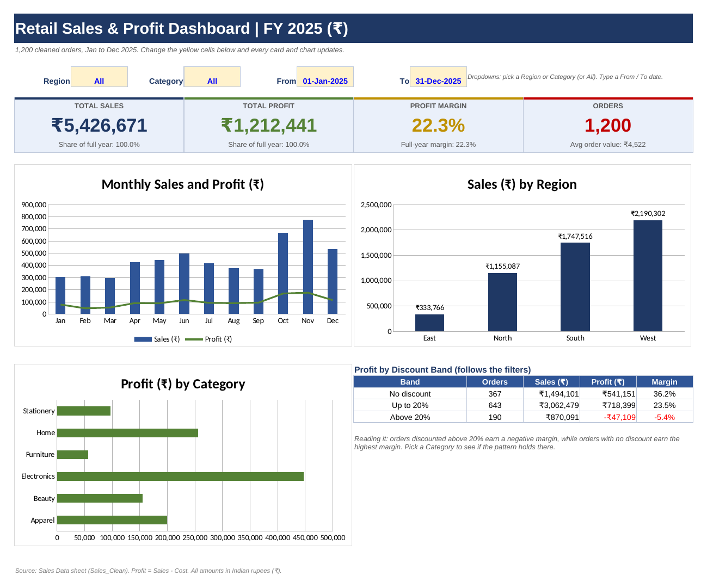

# Retail Sales & Profit Dashboard (Excel)



> **One-page summary for a shop owner:** [Retail_Sales_Summary.pdf](Retail_Sales_Summary.pdf)
> <!-- Add the 60-second screen recording link here: [Watch the demo](https://...) -->

## Business problem

A retail chain sells 40 products across four regions and wants to know **where the profit really comes from**.
Sales look healthy, but nobody has checked which products, discounts and customers make money and which lose it.
This project merges a year of monthly sales files, cleans them, and answers that with KPIs, a product ABC analysis,
a customer RFM segmentation and a one-page dashboard.

## Data

| Item | Detail |
|---|---|
| Source | 12 monthly CSV files, `Sales_2025-01.csv` to `Sales_2025-12.csv` (practice data, amounts in ₹) |
| Size | 1,210 raw rows, **1,200 orders** after cleaning, 40 products, 220 customers, Jan to Dec 2025 |
| Columns | Order and ship dates, customer, segment, region, city, category, product, qty, unit price, discount, sales, cost, profit, returned |

## Method

1. **Merge and clean (Power Query).** Combined the 12 files, then fixed four planted data issues:
   inconsistent spaces and capitals in `Customer Name` and `Region`, `Yes/No` instead of `Y/N` in `Returned` (Sep to Dec),
   and 10 exact duplicate rows. Script: [`power_query/Sales_Clean.m`](power_query/Sales_Clean.m).
   The same logic is reproduced and reconciled in [`scripts/clean_and_verify.py`](scripts/clean_and_verify.py).
2. **KPIs.** `SUMIFS`, `COUNTIFS`, `SUMPRODUCT`: sales, profit, margin, average order value, return rate, month-on-month change, loss-making orders, shipping time.
3. **Product ABC analysis.** Ranked products by sales and class them A (first 80% of sales), B (next 15%), C (rest); flagged loss-makers and dead stock.
4. **Customer RFM analysis.** Scored every customer 1 to 3 on recency, frequency and spend using lookup tables with approximate match (`INDEX/MATCH`), then segmented them: Champion, Loyal, At Risk, Lost.
5. **Pivot-style summaries and dashboard.** Region, category x region, month and quarter, sub-category, discount band. The dashboard has four KPI cards, three charts, a discount-band table, Region and Category dropdowns and a From / To date range, all formula-driven so every number recalculates.

### Data cleaning reconciliation

| Check | Result |
|---|---|
| Rows before cleaning | 1,210 |
| Duplicate rows removed | 10 |
| Rows after cleaning | **1,200** |
| Total sales | **₹5,426,671** |
| Distinct customers / regions | 220 / 4 (was 11 region spellings) |
| Returned = Y | 48 |

## Headline results

| KPI | Value |
|---|---|
| Total sales | ₹5,426,671 |
| Total profit | ₹1,212,441 |
| Profit margin | 22.3% |
| Orders / average order value | 1,200 / ₹4,522 |
| Return rate | 4.0% |
| Loss-making orders | 92 (total loss ₹85,926) |

## Top findings

1. **Discounts above 20% destroy profit.** 190 orders (16% of all orders) earned a **-5.4% margin** (₹47,109 loss) while undiscounted orders earned 36.2%.
   *Action:* cap discounts at 20% and require approval above it.
2. **Furniture is 31% of sales but only 3.4% margin.** Bookshelf is a top-3 seller (₹432,523 sales) and **loses ₹22,877**; Storage is the only sub-category with a negative profit.
   *Action:* reprice Bookshelf, Study Table and Shoe Rack or renegotiate cost; stop deep Furniture discounts.
3. **A few products carry the business.** 13 of 38 products sold are Class A and make **79.2% of sales**; Noise-Cancelling Headphones alone are 20.2% of sales and ₹275,057 profit. 4 products sold fewer than 10 units.
   *Action:* protect stock of Class A items, clear or delist the dead stock.
4. **Q4 is 36.5% of annual sales** (November peak ₹776,952), then December drops 31.4%. Q1 is the weakest quarter.
   *Action:* stock and advertise ahead of October, push loyalty offers in December to Q1.
5. **67 Champion customers (30%) generate 62.6% of sales**, and 56 At Risk customers have spent ₹457,582.
   *Action:* VIP programme for Champions, win-back offer for At Risk.

Estimated profit impact of each finding, and the assumptions used, are in the `6 Insights` sheet.

## Product ABC and customer RFM at a glance

| ABC class | Products | Share of sales |   | RFM segment | Customers | Share of sales |
|---|---|---|---|---|---|---|
| A | 13 | 79.2% |   | Champion | 67 | 62.6% |
| B | 11 | 15.3% |   | Loyal | 76 | 27.5% |
| C | 16 (2 never sold) | 5.4% |   | At Risk | 56 | 8.4% |
|   |   |   |   | Lost | 21 | 1.5% |

## Repository contents

```
03-retail-sales-profit-dashboard/
├── README.md
├── Retail_Sales_Profit_Dashboard.xlsx   # KPIs, ABC, RFM, pivots, dashboard, insights
├── Retail_Sales_Summary.pdf             # one-page client summary
├── images/dashboard.png                 # dashboard screenshot
├── power_query/Sales_Clean.m            # Power Query M script (merge + clean)
├── scripts/clean_and_verify.py          # pandas re-run of the cleaning with control totals
└── data/
    ├── raw/                             # the 12 monthly CSV files
    └── clean/Sales_Clean.csv            # cleaned output (1,200 rows)
```

### Workbook sheets

`Sales Data` (clean table + `Discount Band` helper column) · `Power Query Steps` · `2 KPI Tasks` · `Products` (ABC) · `Customers` (RFM) · `Pivots` · `Dashboard` · `6 Insights` · `Answer Key` (self-check: **44 out of 44**).

## How to reproduce

**Excel:** open the workbook and go to the `Dashboard` sheet. Use the yellow cells (Region, Category, From, To) to filter.
To rebuild the query: *Data > Get Data > From Other Sources > Blank Query > Advanced Editor*, paste `Sales_Clean.m`, change `FolderPath`, then *Close & Load To... > Connection + Table* named `Sales_Clean`.

**Python check:**
```bash
pip install pandas openpyxl
python scripts/clean_and_verify.py
```
It rebuilds the clean table from the 12 CSV files, asserts the control totals above and compares it cell by cell with the `Sales Data` sheet.

## Skills shown

Power Query (merge, clean, de-duplicate) · `SUMIFS` / `COUNTIFS` / `SUMPRODUCT` / `INDEX-MATCH` · ABC and RFM analysis · pivot-style summaries · dashboard design · data storytelling for non-technical owners.
